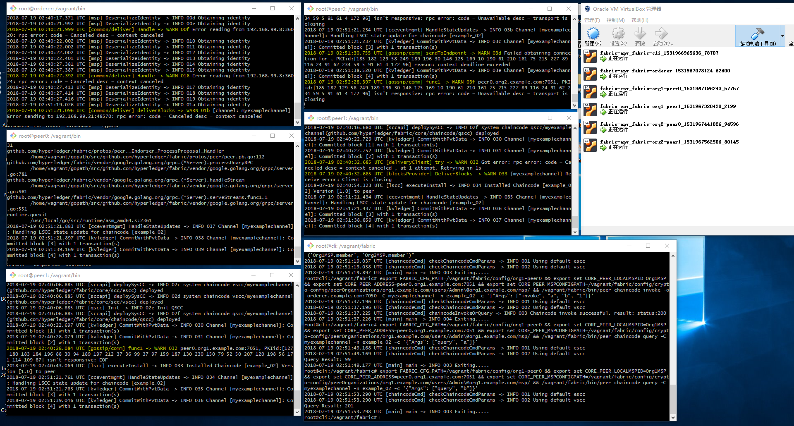

Fabric Vagrant Environment
========================================
This is the experimental  fabirc environment based on vagrant, especially for windows users.  



## Folders
1. fabric      - based on fabric version 1.1
2. fabric1.2 - base on fabric version 1.2 

### Vagrant Base Box

The vagrant base box is installed, with git, docker-ce, go environment. 

( and other necessary dependencies to build the fabric chaincode)

```shell
root@cli:/home/vagrant# go env
GOARCH="amd64"
GOBIN=""
GOCACHE="/root/.cache/go-build"
GOEXE=""
GOHOSTARCH="amd64"
GOHOSTOS="linux"
GOOS="linux"
GOPATH="/home/vagrant/gopath"
GORACE=""
GOROOT="/usr/local/go"
GOTMPDIR=""
GOTOOLDIR="/usr/local/go/pkg/tool/linux_amd64"
GCCGO="gccgo"
CC="gcc"
CXX="g++"
CGO_ENABLED="1"
CGO_CFLAGS="-g -O2"
CGO_CPPFLAGS=""
CGO_CXXFLAGS="-g -O2"
CGO_FFLAGS="-g -O2"
CGO_LDFLAGS="-g -O2"
PKG_CONFIG="pkg-config"
GOGCCFLAGS="-fPIC -m64 -pthread -fmessage-length=0 -fdebug-prefix-map=/tmp/go-build360676645=/tmp/go-build -gno-record-gcc-switches"
```

### Fabric

The fabric sources are compiled under the base box

- The fabric sources are house under $GOPATH/src/github.com/hyperledger/fabric

- All the fabric releases are copied to `/usr/local/bin` ( fabric version 1.1.0 )
- All the fabric base docker images are already built

## Servers

| Server Name       | IP            | Comment        |
| :---------------- | ------------- | -------------- |
| fabric-cli        | 192.168.99.8  | fabric client  |
| fabric-orderer    | 192.168.99.9  | fabric orderer |
| fabric-org1-peer0 | 192.168.99.10 | org1 peer0     |
| fabric-org1-peer1 | 192.168.99.11 | org1 peer1     |
| fabric-org2-peer0 | 192.168.99.20 | org2 peer0     |
| fabric-org2-peer1 | 192.168.99.21 | org2 peer1     |

## Fabric-cli

Then you can ssh to fabric-cli box to interact with fabric

1. create channel

   `export FABRIC_CFG_PATH=/vagrant/fabric/config/org1-peer0 && export set CORE_LOCALMSPID=Org1MSP && export set CORE_PEER_MSPCONFIGPATH=/vagrant/fabric/config/crypto-config/peerOrganizations/org1.example.com/users/Admin\@org1.example.com/msp/ && /vagrant/fabric/bin/peer channel create -o orderer.example.com:7050 -c myexamplechannel -f /vagrant/fabric/myexamplechannel.tx`

2. join to channel

   1. `export FABRIC_CFG_PATH=/vagrant/fabric/config/org1-peer0 && export set CORE_LOCALMSPID=Org1MSP && export set CORE_PEER_ADDRESS=peer0.org1.example.com:7051 export set CORE_PEER_MSPCONFIGPATH=/vagrant/fabric/config/crypto-config/peerOrganizations/org1.example.com/users/Admin\@org1.example.com/msp/ && /vagrant/fabric/bin/peer channel join -b /vagrant/fabric/myexamplechannel.block`
   2. `export FABRIC_CFG_PATH=/vagrant/fabric/config/org1-peer1 && export set CORE_LOCALMSPID=Org1MSP && export set CORE_PEER_ADDRESS=peer1.org1.example.com:7051 export set CORE_PEER_MSPCONFIGPATH=/vagrant/fabric/config/crypto-config/peerOrganizations/org1.example.com/users/Admin\@org1.example.com/msp/ && /vagrant/fabric/bin/peer channel join -b /vagrant/fabric/myexamplechannel.block`
   3. `export FABRIC_CFG_PATH=/vagrant/fabric/config/org2-peer0 && export set CORE_LOCALMSPID=Org2MSP && export set CORE_PEER_ADDRESS=peer0.org2.example.com:7051 export set CORE_PEER_MSPCONFIGPATH=/vagrant/fabric/config/crypto-config/peerOrganizations/org2.example.com/users/Admin\@org2.example.com/msp/ && /vagrant/fabric/bin/peer channel join -b /vagrant/fabric/myexamplechannel.block`
   4. `export FABRIC_CFG_PATH=/vagrant/fabric/config/org2-peer1 && export set CORE_LOCALMSPID=Org2MSP && export set CORE_PEER_ADDRESS=peer1.org2.example.com:7051 export set CORE_PEER_MSPCONFIGPATH=/vagrant/fabric/config/crypto-config/peerOrganizations/org2.example.com/users/Admin\@org2.example.com/msp/ && /vagrant/fabric/bin/peer channel join -b /vagrant/fabric/myexamplechannel.block`

3. update panchors

   1. `export FABRIC_CFG_PATH=/vagrant/fabric/config/org1-peer0 && export set CORE_LOCALMSPID=Org1MSP && export set CORE_PEER_ADDRESS=peer0.org1.example.com:7051 && export set CORE_PEER_MSPCONFIGPATH=/vagrant/fabric/config/crypto-config/peerOrganizations/org1.example.com/users/Admin\@org1.example.com/msp/ && /vagrant/fabric/bin/peer channel update -o orderer.example.com:7050 -c myexamplechannel -f /vagrant/fabric/org1MSPanchors.tx`
   2. `export FABRIC_CFG_PATH=/vagrant/fabric/config/org2-peer0 && export set CORE_LOCALMSPID=Org2MSP && export set CORE_PEER_ADDRESS=peer0.org2.example.com:7051 && export set CORE_PEER_MSPCONFIGPATH=/vagrant/fabric/config/crypto-config/peerOrganizations/org2.example.com/users/Admin\@org2.example.com/msp/ && /vagrant/fabric/bin/peer channel update -o orderer.example.com:7050 -c myexamplechannel -f /vagrant/fabric/org2MSPanchors.tx`

4. install chaincode

   1. `export FABRIC_CFG_PATH=/vagrant/fabric/config/org1-peer0 && export set CORE_PEER_LOCALMSPID=Org1MSP && export set CORE_PEER_ADDRESS=peer0.org1.example.com:7051 && export set CORE_PEER_MSPCONFIGPATH=/vagrant/fabric/config/crypto-config/peerOrganizations/org1.example.com/users/Admin\@org1.example.com/msp/ && /vagrant/fabric/bin/peer chaincode install -n example_02 -v 1.0 -p github.com/hyperledger/fabric/examples/chaincode/go/chaincode_example02`
   2. `export FABRIC_CFG_PATH=/vagrant/fabric/config/org1-peer1 && export set CORE_PEER_LOCALMSPID=Org1MSP && export set CORE_PEER_ADDRESS=peer1.org1.example.com:7051 && export set CORE_PEER_MSPCONFIGPATH=/vagrant/fabric/config/crypto-config/peerOrganizations/org1.example.com/users/Admin\@org1.example.com/msp/ && /vagrant/fabric/bin/peer chaincode install -n example_02 -v 1.0 -p github.com/hyperledger/fabric/examples/chaincode/go/chaincode_example02`
   3. `export FABRIC_CFG_PATH=/vagrant/fabric/config/org2-peer0 && export set CORE_PEER_LOCALMSPID=Org2MSP && export set CORE_PEER_ADDRESS=peer0.org2.example.com:7051 && export set CORE_PEER_MSPCONFIGPATH=/vagrant/fabric/config/crypto-config/peerOrganizations/org2.example.com/users/Admin\@org2.example.com/msp/ && /vagrant/fabric/bin/peer chaincode install -n example_02 -v 1.0 -p github.com/hyperledger/fabric/examples/chaincode/go/chaincode_example02`
   4. `export FABRIC_CFG_PATH=/vagrant/fabric/config/org2-peer1 && export set CORE_PEER_LOCALMSPID=Org2MSP && export set CORE_PEER_ADDRESS=peer1.org2.example.com:7051 && export set CORE_PEER_MSPCONFIGPATH=/vagrant/fabric/config/crypto-config/peerOrganizations/org2.example.com/users/Admin\@org2.example.com/msp/ && /vagrant/fabric/bin/peer chaincode install -n example_02 -v 1.0 -p github.com/hyperledger/fabric/examples/chaincode/go/chaincode_example02`

5. instantiate chaincode

   `export FABRIC_CFG_PATH=/vagrant/fabric/config/org1-peer0 && export set CORE_PEER_LOCALMSPID=Org1MSP && export set CORE_PEER_ADDRESS=peer0.org1.example.com:7051 && export set CORE_PEER_MSPCONFIGPATH=/vagrant/fabric/config/crypto-config/peerOrganizations/org1.example.com/users/Admin\@org1.example.com/msp/ && /vagrant/fabric/bin/peer chaincode instantiate -o orderer.example.com:7050 -C myexamplechannel -n example_02 -v 1.0 -c '{"Args": ["init", "a", "100", "b", "200"]}' -P "OR ('Org1MSP.member', 'Org2MSP.member')"`

6. invoke chaincode

   `export FABRIC_CFG_PATH=/vagrant/fabric/config/org1-peer0 && export set CORE_PEER_LOCALMSPID=Org1MSP && export set CORE_PEER_ADDRESS=peer0.org1.example.com:7051 && export set CORE_PEER_MSPCONFIGPATH=/vagrant/fabric/config/crypto-config/peerOrganizations/org1.example.com/users/Admin\@org1.example.com/msp/ && /vagrant/fabric/bin/peer chaincode invoke -o orderer.example.com:7050 -C myexamplechannel -n example_02 -c '{"Args": ["invoke", "a", "b", "1"]}'`

7. query chaincode

   `export FABRIC_CFG_PATH=/vagrant/fabric/config/org1-peer0 && export set CORE_PEER_LOCALMSPID=Org1MSP && export set CORE_PEER_ADDRESS=peer0.org1.example.com:7051 && export set CORE_PEER_MSPCONFIGPATH=/vagrant/fabric/config/crypto-config/peerOrganizations/org1.example.com/users/Admin\@org1.example.com/msp/ && /vagrant/fabric/bin/peer chaincode query -C myexamplechannel -n example_02 -c '{"Args": ["query", "a"]}'`

## Troubleshooting
1. "chaincode": executable file not found in $PATH
> 2018-07-17 02:38:47.687 UTC [chaincode] Launch -> ERRO 02c start failed: API error (404): invalid header field value "oci runtime error: container_linux.go:247: starting container process caused \"exec: \\\"chaincode\\\": executable file not found in $PATH\"\n" 

Need install `libltdl-dev` on ubuntu
```shell
sudo apt install libltdl-dev
```


## TODO

1. CouchDB
2. Kafka
3. CA
4. Hyperledger Explorer

